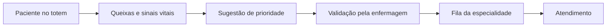

# TriageFlow

Sistema de apoio à triagem inicial em unidades de saúde. Um totem coleta queixas e sinais vitais do paciente, o sistema sugere a prioridade de atendimento e a equipe de enfermagem valida antes do encaminhamento.

> ⚠️ **Projeto em desenvolvimento.** Não é um dispositivo médico certificado e não deve ser usado em atendimento real.

## Como funciona



1. **Chegada:** o paciente inicia a triagem no totem, sem necessidade de cadastro prévio.
2. **Coleta:** o totem registra as queixas, informações relevantes (condições pré-existentes, alergias, medicamentos em uso) e sinais vitais medidos por sensores.
3. **Sugestão:** o sistema sugere prioridade e especialidade com base em regras de classificação de risco. Sinais de alarme geram alerta imediato para a equipe.
4. **Validação:** um profissional de enfermagem confirma ou ajusta a classificação. A decisão final é sempre humana.
5. **Fila:** o paciente entra na fila da especialidade, ordenada por prioridade e tempo de espera.

## Objetivo

Reduzir o tempo até a classificação de risco, organizar as filas de atendimento e oferecer à equipe informações estruturadas desde o primeiro contato com o paciente.

## Status

🚧 Em concepção: arquitetura e requisitos definidos, desenvolvimento do MVP em início.

## Stack

| Camada | Tecnologia |
|---|---|
| API | .NET (ASP.NET Core) |
| Dashboards | React + TypeScript |
| App do totem | Em avaliação |
| Banco de dados | PostgreSQL |

## Estrutura do repositório

```
api/        API em .NET
clientes/   dashboards e app do totem
regras/     formato e casos de teste das regras de classificação
infra/      configuração de implantação
docs/       documentação técnica
```

## Como executar

Em breve.

## Documentação

A documentação técnica (visão, requisitos, arquitetura e decisões) está em [`docs/`](docs/).

## Licença

A definir.
